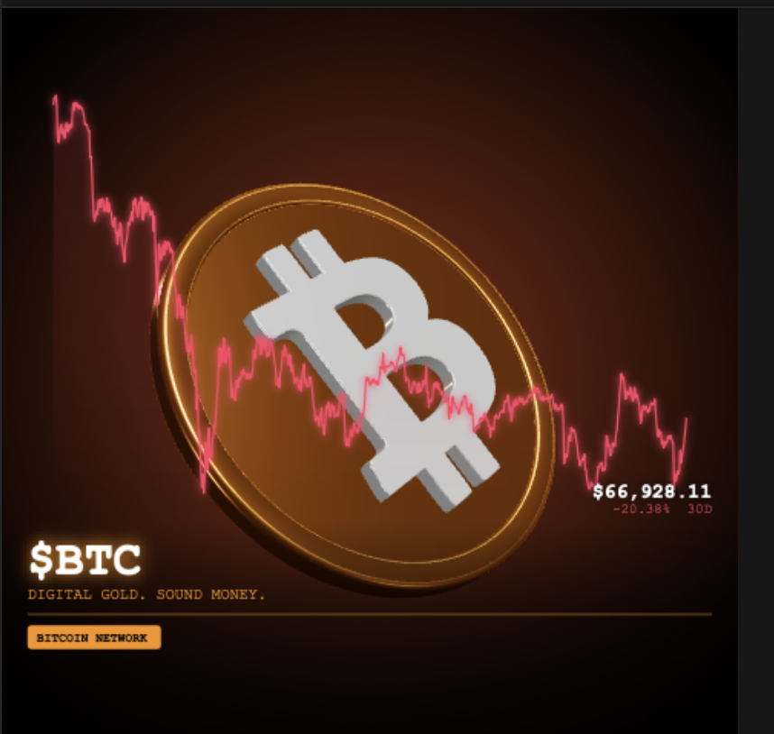
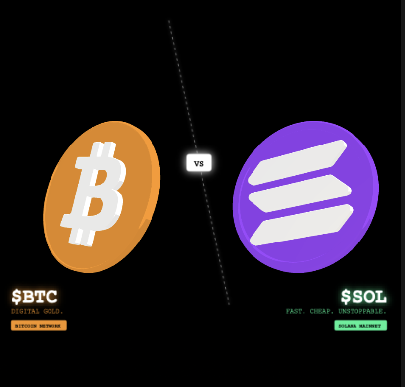

# ⬡ MINTFRAME — 3D Coin Animator

A browser-based 3D coin renderer and marketing asset tool for blockchain projects. Built with React, TypeScript, Three.js, and Vite. No backend, no API keys.

<p float="left">
  
  

</p>

## Getting Started

```bash
npm install
npm run dev
```

Open `http://localhost:5173` in any modern browser.

---

## Features

### Coin

Physically-based rendering (PBR) via Three.js. Lathe-geometry coin with configurable thickness, rim width, and rim step profile. Four render styles: **Photorealistic**, **Flat/2D**, **Cel Shaded**, **Clay**.

Token presets (BTC, ETH, SOL, ALGO, AVAX, LINK) auto-apply matching coin color, metalness, roughness, lights, and logo color in one click.

Material presets (Gold, Silver, Copper, Dark, Neon) apply independently of token selection.

### Logo

Paste any `<svg>` markup or a raw path `d="…"` string to extrude a 3D logo onto the coin face. The parser handles compound paths with holes (e.g. the Bitcoin B cutouts) by detecting sub-paths and passing them to Three.js as `Shape.holes[]`, producing clean geometry.

Controls: logo color, scale, extrusion depth, bevel, smoothing samples.

### Animation

Auto-spin modes: Y, X, Z, tumble (XY). Drag-to-rotate with mouse or touch. Configurable rotation speed and X-axis tilt.

### Lighting

Key, secondary, rim, ambient, and fill lights. Adjustable intensity and hue. Exposure via ACES filmic tone mapping.

### Post FX

- **Glow** — screen-blended bloom, adjustable strength
- **Outline** — alpha-expansion edge detection, custom color and opacity
- **Grain** — per-pixel film grain
- **Vignette** — radial darkening

### Color Grade

Hue rotation, saturation, brightness, contrast. Applied as a CSS filter on the composite canvas and baked into PNG exports.

### Background

Solid color, linear gradient, radial gradient, or mesh gradient. Two color stops with angle control (linear) and six dark presets. Upload an image background for custom compositing. Green screen (`#00ff00`) works for chroma keying.

### Overlay

Marketing text overlay for social posts (1:1 aspect ratio):

- Token name, tagline, chain badge
- Text color, accent color, badge background
- Custom font (Courier New, Georgia, Arial, Impact, Trebuchet, Palatino, Lucida Console)
- Gradient bar opacity

### Price Chart

Live chart from the CoinGecko public API — no key required:

- Any CoinGecko coin ID (`bitcoin`, `ethereum`, `algorand`, etc.)
- Timeframes: 1H, 1D, 7D, 30D
- Layout: **Background** (full-canvas sparkline) or **Side Panel**
- Green/red based on price direction, optional price + % change label
- Animated draw with presets: Instant, Smooth, Dramatic, Glitch

### Effects

**Confetti** — particle system with presets (Gold Rain, Moon Blast, Diamond, Fire Rise) and full custom controls: particle count, speed, spread, size, gravity, shapes, fade-out, burst mode.

**Chart Animation** — controls how the price chart draws in: duration, easing, trail glow, trail length, dot pulse.

### VS Mode

Side-by-side comparison of two coins — useful for "X vs Y" social posts.

- Left coin uses the main Coin and Logo tabs
- Right coin is fully independent: its own material color, metalness, roughness, logo SVG, and logo color
- Token quick-pick applies a full preset (color, logo, overlay text) to the right coin in one click
- Independent overlay text per side: token name, tagline, chain badge, accent color
- Independent chart fetch per side
- Diagonal divider with custom label and color
- Camera zoom control

### Scene

Multi-coin layout mode (1–7 coins), independent of VS:

- Layout: Row, Arc, Circle, Grid
- Camera zoom
- Phase offset toggle (staggered vs lockstep rotation)
- Dot-diagram preview of the layout

### Export

> **Note:** PNG snapshot and PNG sequence are the recommended export paths. WebM recording is functional but temporarily unlisted — color rendering in the recorded output is being investigated.

- **PNG snapshot** — current frame exactly as seen on screen, with optional transparent background. Color grade is baked in.
- **PNG sequence** — full 360° rotation rendered at fixed angle steps. Each frame is a separate download. Pipe into ffmpeg for GIF or MP4.
- **Post PNG** — composites the coin onto a full-resolution canvas (1:1) with overlay and chart baked in.

**FFmpeg:**

```bash
# PNG sequence → GIF
ffmpeg -r 30 -i coin_%04d.png -vf "fps=30,scale=512:-1" coin.gif

# PNG sequence → MP4
ffmpeg -r 30 -i coin_%04d.png -c:v libx264 -pix_fmt yuv420p coin.mp4

# PNG sequence → MP4 with alpha (ProRes)
ffmpeg -r 30 -i coin_%04d.png -c:v prores_ks -pix_fmt yuva444p10le coin.mov
```

---

## Project Structure

```
src/
├── App.tsx                  # Root layout, tab routing, desktop + mobile shell
├── components/
│   ├── CoinCanvas.tsx       # Three.js canvas + 2D overlay composite
│   ├── PanelCoin.tsx        # Material, render style, token/material presets
│   ├── PanelLogo.tsx        # SVG logo import and controls
│   ├── PanelAnimation.tsx   # Rotation mode, speed, tilt, lighting
│   ├── PanelFX.tsx          # Post FX toggles and color grade
│   ├── PanelOverlay.tsx     # Marketing overlay and price chart
│   ├── PanelEffects.tsx     # Confetti and chart animation
│   ├── PanelVS.tsx          # VS mode — two independent coins
│   ├── PanelScene.tsx       # Multi-coin layout
│   ├── PanelBackground.tsx  # Gradient and image background
│   ├── PanelExport.tsx      # Export controls
│   ├── TokenPresets.tsx     # Token preset picker widget
│   └── ui.tsx               # Shared primitives (Slider, ColorRow, ToggleGroup, etc.)
├── hooks/
│   └── useAppState.ts       # All application state
├── lib/
│   ├── CoinEngine.ts        # Three.js engine — per-slot materials, layout, snapshot
│   ├── overlayUtils.ts      # 2D canvas overlay and VS layout rendering
│   ├── chartUtils.ts        # CoinGecko fetch and chart drawing
│   ├── chartAnim.ts         # Animated chart draw presets
│   ├── confetti.ts          # Particle system
│   └── presets.ts           # Token presets, material presets, font/resolution lists
└── types/
    └── index.ts             # All shared TypeScript interfaces
```

---

## Notes

- CoinGecko public API is rate-limited — avoid rapid repeated fetches
- SVG logo parser handles compound paths with holes via `Shape.holes[]` in Three.js
- PNG sequence downloads trigger individual browser download dialogs — browser may ask for permission to download multiple files
- VS mode forces 2-coin layout and disables Scene controls while active
- All export uses 1:1 aspect ratio to match the square preview canvas

---

## License

CC0 1.0 Universal — public domain. No rights reserved. Use for any purpose without attribution.
